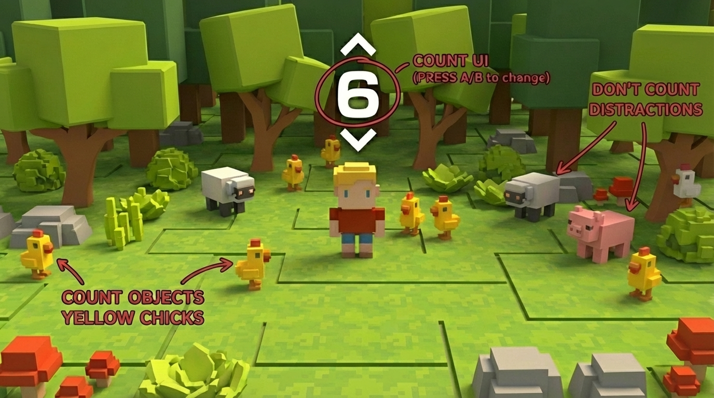

# ThreeJS Agent Skill Demo Forest Census

> Included in the [Vibe Jam Starter Pack](../../README.md). For more AI gamedev starter projects, workflows, and resources, visit [vibegamedev.com](https://vibegamedev.com?utm_source=github&utm_medium=project_readme&utm_campaign=forest-census-pack).

A single-scene Three.js experience where players count yellow chicks in a stylized voxel forest within 20 seconds. The repo is structured for static hosting (Vercel-ready) with a lightweight landing page that links to the game.

<p align="center">
  
</p>

## Project Layout

```
public/
├─ index.html          # Landing page with CTA to /forest
├─ assets.json         # Manifest consumed by forest/index.html
├─ ASSET_INDEX.md      # Human-readable mirror of assets.json (deployed)
├─ assets/             # GLTF models referenced by the manifest
└─ forest/
   ├─ index.html       # Main Three.js experience
   ├─ PRD.md           # Product requirements
   └─ TDD.md           # Technical design
vercel.json            # Static hosting config (clean URLs, caching)
```

Key rule: anything under `public/` gets deployed. Keep tooling/docs outside this folder so they never leak to production.

## Running Locally

```bash
npm install -g serve   # or use npx serve
serve public
```

Then visit:
- `http://localhost:3000/` — landing page
- `http://localhost:3000/forest/` — game (loads `/assets.json` and `/assets/**/*.gltf` from the same origin)

## Asset Attribution

- This starter includes low-poly 3D game assets associated with [Quaternius](https://quaternius.com/)

If you reuse or redistribute the assets outside this starter pack, check the original pack pages and license terms.

## Deployment (Vercel)

1. In the Vercel dashboard, create a project from this repo.
2. Framework preset: **Other**. Leave the build command empty.
3. Set the output directory to `public` (or rely on `vercel.json` which declares it).
4. Deploy. Clean URLs are enabled, so `/forest` and `/forest/` both work. Static assets in `/assets` are cached with `Cache-Control: public,max-age=31536000,immutable`.

## Asset Management

- `public/assets.json` is the single source of truth for model paths. `forest/index.html` fetches it and resolves the URLs at runtime.
- `public/ASSET_INDEX.md` mirrors the manifest for humans (and is visible at `/ASSET_INDEX.md` once deployed).
- When adding or pruning models, update both the manifest and index so the scene and docs stay aligned.

## Skills & References

The build leans on the local `threejs-builder` skill for reference-frame contracts, animation handling, and ES-module patterns. See `.agents/skills/threejs-builder/SKILL.md` if you need to extend the scene.

## Resources

- [TinyPRD](https://tinyprd.app?utm_source=github&utm_campaign=forest_census) — build concise product briefs (used for this game's PRD)

Happy counting!
