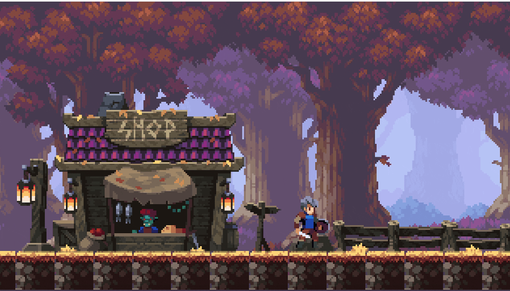

# Phaser 2D GameDev (Oak Woods Platformer) + Agent Skills

> Included in the [Vibe Jam Starter Pack](../../README.md). For more AI gamedev starter projects, workflows, and resources, visit [vibegamedev.com](https://vibegamedev.com?utm_source=github&utm_medium=project_readme&utm_campaign=oakwoods-pack).

This repo is the companion project for the YouTube build:
**“Vibe Coding 2D Games with Claude Code & Agent Skills (Full Tutorial)”** ([watch on YouTube](https://www.youtube.com/watch?v=QPZCMd5REP8))

It includes:
- A small Phaser 3 + TypeScript + Vite platformer scene (parallax background, infinite ground, movement/jump/attack).
- The **Agent Skills** used in the video.

## Want more?

If you want the all-in-one workflow kit I use across **Claude Code, agent tools, and Cursor**—including ready-to-run agents/skills/rules and full source from my YouTube builds—check out [BuilderPack.ai](https://www.builderpack.ai/?utm_campaign=claude_19&utm_source=github&utm_medium=readme).


## Quickstart

1) Install deps:
```bash
npm install
```

2) Add the **Oak Woods** art pack (required — not included in this repo). See **Assets (Required)** below.

3) Run:
```bash
npm run dev
```

Controls:
- Arrow keys: move + jump
- `X`: attack

## Included Agent Skills

This repo ships **two skills**, each packaged for both tools (so 4 copies total):

- **Phaser game dev**
  - Claude Code: `.claude/skills/phaser-gamedev/SKILL.md`
  - Agent-compatible: `.agents/skills/phaser-gamedev/SKILL.md`
- **Playwright testing (including canvas/Phaser testing patterns)**
  - Claude Code: `.claude/skills/playwright-testing/SKILL.md`
  - Agent-compatible: `.agents/skills/playwright-testing/SKILL.md`

Each `SKILL.md` contains its triggers, workflow, and reference docs.

## Assets (Required)

This repository **does not** include the Oak Woods art assets (we can’t redistribute them).

1) Get the pack from:
- [Oak Woods (itch.io)](https://brullov.itch.io/oak-woods)

2) Extract/copy the assets into:
`public/assets/oakwoods/`

The game expects this structure (filenames and folders must match):

```
public/assets/oakwoods/
  assets.json
  oak_woods_tileset.png
  background/
    background_layer_1.png
    background_layer_2.png
    background_layer_3.png
  character/
    char_blue.png
  decorations/
    fence_1.png
    fence_2.png
    grass_1.png
    grass_2.png
    grass_3.png
    lamp.png
    rock_1.png
    rock_2.png
    rock_3.png
    shop.png
    shop_anim.png
    sign.png
```

Notes:
- `public/assets/oakwoods/assets.json` **is included** here as a manifest/index.
- Only the manifest is tracked; the extracted art is ignored by git.

## Credits (Oak Woods)

Oak Woods asset pack by **brullov**:
- [Oak Woods (itch.io)](https://brullov.itch.io/oak-woods)
- [@brullov_art (X)](https://x.com/brullov_art)
