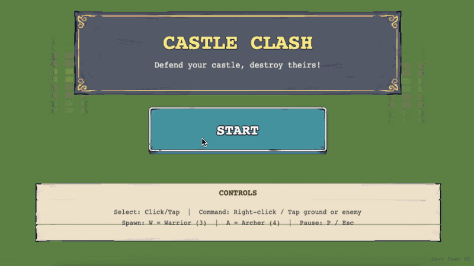

# Castle Clash Duel

> Included in the [Vibe Jam Starter Pack](../../README.md). For more AI gamedev starter projects, workflows, and resources, visit [vibegamedev.com](https://vibegamedev.com?utm_source=github&utm_medium=project_readme&utm_campaign=tinyswords-pack).

**A vibe-coded 2D strategy game prototype showcasing rapid game development with AI agent skills**



## 🎯 What is This?

This is a **prototype 2D tactical strategy game** built through **vibe coding** - a rapid development workflow powered by specialized AI agent skills. The game was created by combining a well-structured PRD (from [TinyPRD](https://tinyprd.app?utm_source=github&utm_medium=readme&utm_campaign=vibe_tiny_swords)) with three specialized Claude Code skills, demonstrating how AI-assisted development can go from concept to playable prototype.

**The Result:** A turn-based strategy game prototype with warriors, archers, particle effects, dynamic UI, and test coverage - all in ~580KB of carefully curated assets.

> **Note:** This is a prototype demonstrating the vibe coding workflow. It's not production-ready or highly polished - the focus is on showcasing rapid AI-assisted development rather than delivering a finished product.

## 🎮 Play the Game

**🎯 [Play Online Now →](https://vibe-tiny-swords.vercel.app/)**

Or run locally by opening `public/index.html` in a modern web browser. No build process or dependencies required!

## Asset Attribution

- Tiny Swords asset pack by [Pixel Frog](https://pixelfrog-assets.itch.io/tiny-swords)

If you reuse or redistribute the asset pack outside this starter pack, check the original asset page and license terms.

**Game Features:**
- Two-player turn-based strategy combat
- Recruit warriors and archers with unique abilities
- Dynamic health bars and visual feedback
- Animated unit sprites and particle effects
- Custom tilemap rendering with terrain variety
- Interactive UI with nine-slice scaling for responsive panels

## ⚡ The Vibe Coding Workflow

This project demonstrates the complete vibe coding workflow:

### 1. **PRD Creation** ([TinyPRD](https://tinyprd.app))

Started with a clear, concise Product Requirements Document that defined:
- Game mechanics and win conditions
- Visual style and color palette
- Technical constraints (Phaser 3, single HTML file)
- Asset specifications and UI requirements

📄 See the full PRD: [`docs/prd.md`](docs/prd.md)

**Why TinyPRD?** A well-structured PRD helps with vibe coding. [TinyPRD](https://tinyprd.app) helps you write clear, actionable requirements that AI agents can work with more effectively.

### 2. **Technical Design Document**

Translated the PRD into detailed technical specifications:
- Scene architecture and state management
- Asset loading strategies
- UI component breakdown
- Testing requirements

📄 See the full TDD: [`docs/tdd.md`](docs/tdd.md)

### 3. **Asset Metadata Structure** (`assets.json`)

Created a comprehensive metadata file documenting the Tiny Swords asset pack structure:
- Spritesheet frame dimensions for units, terrain, and particles
- Color variant mappings (blue, red, yellow, etc.)
- Path templates for buildings and UI elements
- Tile sizes and grid specifications

📄 See the asset metadata: [`public/assets/tinyswords/assets.json`](public/assets/tinyswords/assets.json)

**Why this matters:** AI agents can reference this metadata to make informed decisions about asset loading, frame extraction, and spritesheet handling without manual trial-and-error. It serves as a "contract" between the asset pack and the code.

### 4. **Implementation with Agent Skills**

With the PRD, TDD, and asset metadata in place, the game was built using three specialized Claude Code skills that handle complex, domain-specific tasks:

#### 🎨 **Phaser GameDev**
Advanced 2D game development with the Phaser 3 framework:
- Scene lifecycle management (Boot, Menu, Gameplay)
- Sprite animation systems
- Turn-based combat logic
- Particle effects and visual polish
- Custom UI architecture with nine-slice scaling

**Key Challenge Solved:** Nine-slice panel rendering with the Tiny Swords asset pack. The sprites have heavy transparent padding, which creates visual artifacts when scaled naively. The solution involved custom texture stitching with calculated overlap to hide edges.

See implementation: `test.html:282-315` (createStitchedTexture method)

#### 🗺️ **TinySwords Tilemap**
Professional tilemap rendering optimized for the Tiny Swords asset pack:
- 64×64 tile grid system
- Multiple terrain color variants
- Procedural decoration placement (trees, rocks, bushes)
- Elevation rendering for visual depth

**Asset Optimization:** The skill knew exactly which Tiny Swords assets to use and how to combine them, eliminating guesswork and trial-and-error.

#### ✅ **Frontend Testing**
Basic UI testing infrastructure:
- Dedicated test harness (`test.html`) for visual regression testing
- Isolated component tests for nine-slice panels, ribbons, and health bars
- Test hooks for Playwright integration
- Interactive debugging (press 1-6 to cycle through test scenarios)

**Test Coverage:** UI components have side-by-side comparisons of raw vs. stitched textures for visual verification.

## 🛠️ The Agent Skills Advantage

**Traditional Development:**
1. Research Phaser API documentation
2. Trial-and-error with nine-slice scaling
3. Debug rendering artifacts
4. Manually optimize asset usage
5. Write test infrastructure from scratch

**Vibe Coding with Skills:**
1. Write clear PRD
2. Let specialized skills handle implementation
3. Focus on game design and refinement

**Result:** Faster prototyping by leveraging domain-specific knowledge from specialized skills.

## 📁 Project Structure

```
vibe-tiny-swords/
├── docs/
│   ├── prd.md              # Product requirements (from TinyPRD)
│   └── tdd.md              # Technical design document
├── public/
│   ├── index.html          # Main game (~149KB)
│   ├── test.html           # UI test harness (~27KB)
│   └── assets/
│       └── tinyswords/     # Curated game assets (580KB)
│           ├── assets.json # Asset metadata and structure reference
│           ├── Buildings/  # Blue & Red castles
│           ├── Units/      # Warrior & Archer sprites
│           ├── Terrain/    # Tileset, trees, rocks, bushes
│           ├── Particle FX/# Dust and explosion effects
│           └── UI Elements/# Buttons, bars, panels, ribbons
└── README.md
```

## 🎨 Asset Credits

This game uses the beautiful [Tiny Swords](https://pixelfrog-assets.itch.io/tiny-swords) asset pack by **Pixel Frog**. The assets have been carefully curated to include only what's used in the game, reducing the repository from ~15MB to just **580KB**.

**Included Assets:**
- Blue & Red team units (Warrior, Archer with full animation sets)
- Blue & Red castles
- Terrain tileset with 2 color variants
- Trees, rocks, and bushes for decoration
- UI elements: buttons, health bars, nine-slice panels, ribbons, icons
- Particle effects: dust and explosions

**Why Tiny Swords?** Pixel Frog's asset packs are perfectly suited for vibe coding - they're comprehensive, well-organized, and visually cohesive. The TinySwords Tilemap skill has deep knowledge of these assets, enabling rapid implementation without asset hunting.

## 🚀 Getting Started

1. **Clone the repository**
   ```bash
   git clone <repository-url>
   cd vibe-tiny-swords
   ```

2. **Play the game**
   ```bash
   open public/index.html
   ```

3. **Explore the test harness**
   ```bash
   open public/test.html
   # Press 1-6 to cycle through different UI tests
   ```

4. **Study the workflow**
   - Read [`docs/prd.md`](docs/prd.md) to see the original requirements
   - Read [`docs/tdd.md`](docs/tdd.md) to see the technical design
   - Examine the implementation in `index.html` and `test.html`

## 💡 Key Takeaways for Vibe Coders

### 1. Start with a Clear PRD
Use [TinyPRD](https://tinyprd.app) to write clear, detailed requirements. A well-structured PRD helps guide the development process. Include:
- Clear win conditions and game mechanics
- Specific visual guidelines (colors, style, mood)
- Technical constraints and asset paths
- Assumptions and out-of-scope items

### 2. Leverage Agent Skills
Don't reinvent the wheel. Specialized skills like **Phaser GameDev**, **TinySwords Tilemap**, and **Frontend Testing** bring deep domain knowledge and best practices, saving you from common pitfalls.

### 3. Test as You Build
The test harness (`test.html`) was built alongside the game, not as an afterthought. This caught rendering bugs early and provided confidence for rapid iteration.

### 4. Optimize Ruthlessly
The repository contains exactly what the game needs - no unused assets, no bloat. This makes the codebase easy to understand and fast to download.

**Asset Metadata:** The project includes an `assets.json` file that documents frame dimensions, color variants, and path templates for the Tiny Swords asset pack. This metadata file serves as a reference guide for understanding the asset structure and can be used by AI agents to make informed decisions about asset loading.

## 🧪 Testing Infrastructure

The test harness provides basic visual regression testing:

**Visual Regression Tests:**
- Raw spritesheet frame inspection
- Nine-slice panel scaling at various sizes
- Side-by-side raw vs. stitched texture comparison
- Health bar rendering at different widths and percentages

**Automated Test Hooks:**
```javascript
window.__TEST__ = {
  ready: true,
  sceneKey: 'UITestScene',
  state: () => ({ currentTest, testLabels, currentLabel }),
  commands: {
    showTest: (n) => scene.showTest(n),
    reset: () => scene.showTest(0)
  }
};
```

This enables Playwright or other testing frameworks to:
- Wait for scene initialization
- Query current test state
- Programmatically switch test scenarios
- Capture screenshots for comparison

## 🎓 What You'll See

By exploring this project, you'll find:

✅ **Vibe Coding Workflow** - From PRD to playable prototype
✅ **Agent Skill Integration** - How specialized skills work together
✅ **Phaser 3 Patterns** - Scene management, sprite animation, UI architecture
✅ **Asset Management** - Curating and organizing game assets
✅ **Nine-Slice Rendering** - Addressing UI scaling challenges
✅ **Test Infrastructure** - Building test harnesses alongside features
✅ **Single-File Architecture** - Keeping everything simple and portable

## 🔧 Technical Highlights

### Nine-Slice Texture Stitching
The Tiny Swords UI panels have ~45% transparent padding in each frame. Direct scaling creates thick "bars" at panel edges. The solution:

```javascript
createStitchedTexture(sourceKey, targetKey, frameSize, overlap = 0) {
  // Calculate overlap to hide transparent edges
  const effectiveOverlap = overlap || Math.floor(frameSize * 0.45);
  const cellSize = frameSize - effectiveOverlap;

  // Stitch 9 frames with overlap into a seamless texture
  // Each frame overlaps the previous one to hide padding
  // ...
}
```

**Result:** Panels scale from 100px to 500px with reduced visual artifacts.

### Health Bar Three-Slice Scaling
Health bars use horizontal three-slice scaling (left cap, stretchable center, right cap):

```javascript
getBigBarBaseTexture(width) {
  const spec = {
    left: { x: 40, w: 24 },   // Left cap
    center: { x: 128, w: 64 }, // Stretchable fill
    right: { x: 256, w: 24 }   // Right cap
  };
  // Generate texture at exact width with proper proportions
}
```

**Result:** Health bars scale while maintaining cap proportions.

## 🌐 Browser Compatibility

- Chrome/Edge: Full support ✅
- Firefox: Full support ✅
- Safari: Full support ✅

**Performance:**
- 60 FPS on all modern devices
- ~580KB total asset size
- No external dependencies (uses CDN for Phaser)

## 📖 Further Reading

### Vibe Coding Resources
- [TinyPRD](https://tinyprd.app) - Write better PRDs for AI-assisted development
- [Claude Code](https://claude.com/claude-code) - The CLI tool used to build this

### Phaser & Game Dev
- [Phaser 3 Documentation](https://photonstorm.github.io/phaser3-docs/)
- [Phaser Examples](https://phaser.io/examples)

### Assets
- [Tiny Swords on itch.io](https://pixelfrog-assets.itch.io/tiny-swords) - Full asset pack
- [Pixel Frog Asset Packs](https://pixelfrog-assets.itch.io/) - More great game art

## 🎯 Try It Yourself

Want to vibe code your own game?

1. **Start with a PRD** - Use [TinyPRD](https://tinyprd.app) to structure your game concept
2. **Choose your assets** - Pixel Frog's asset packs are perfect for prototyping
3. **Use Claude Code skills** - Leverage Phaser GameDev and other specialized skills
4. **Build test infrastructure** - Create a test harness early
5. **Iterate rapidly** - Let AI handle implementation while you focus on design

---

**Built with ❤️ using [Claude Code](https://claude.com/claude-code)**

*This project demonstrates vibe coding: combining clear requirements ([TinyPRD](https://tinyprd.app)), game assets ([Pixel Frog](https://pixelfrog-assets.itch.io/)), and specialized AI skills for rapid prototyping.*
