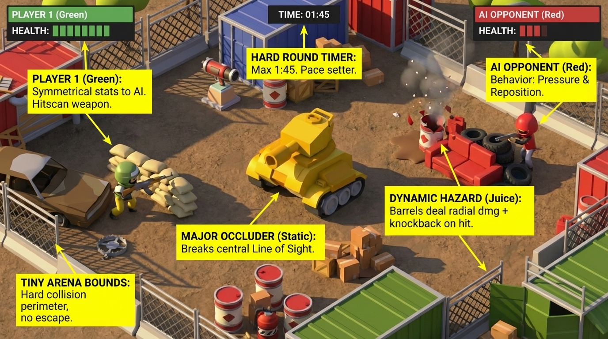

# Tiny Toon Duel (Three.js)

> Included in the [Vibe Jam Starter Pack](../../README.md). For more AI gamedev starter projects, workflows, and resources, visit [vibegamedev.com](https://vibegamedev.com?utm_source=github&utm_medium=project_readme&utm_campaign=toonshooter-pack).

A quick-action toon shooter prototype built with Three.js. This repo is structured for static hosting (Vercel-ready) with a lightweight landing page that links to the game.

<p align="center">
  
</p>

## Project Layout

```
public/
├─ index.html               # Landing page
├─ assets.json              # Asset manifest (loaded by the game)
├─ assets/                  # GLTF models / textures referenced by the manifest
└─ toonshooter/
   └─ index.html            # Main Three.js experience
vercel.json                 # Static hosting config (clean URLs, caching)
```

Anything under `public/` is deployable as-is.

## Running Locally

```bash
npm install -g serve   # or use npx serve
serve public
```

Then visit:
- `http://localhost:3000/` — landing page
- `http://localhost:3000/toonshooter/` — game (loads `/assets.json` and `/assets/**` from the same origin)

## Asset Attribution

- This starter includes low-poly 3D game assets associated with [Quaternius](https://quaternius.com/)

If you reuse or redistribute the assets outside this starter pack, check the original pack pages and license terms.

## Deployment (Vercel)

1. In the Vercel dashboard, create a project from this repo.
2. Framework preset: **Other**. Leave the build command empty.
3. Set the output directory to `public` (or rely on `vercel.json` which declares it).
4. Deploy. Clean URLs are enabled, so `/toonshooter` and `/toonshooter/` both work. Static assets in `/assets` are cached with `Cache-Control: public,max-age=31536000,immutable`.

## Asset Management

- `public/assets.json` is the single source of truth for model paths. `public/toonshooter/index.html` fetches it and resolves URLs at runtime.
- When adding or pruning models, update the manifest so the scene and assets stay aligned.

## Local Dev Notes

- Optional Three.js workflow references live in `.claude/skills/threejs-builder/` (not deployed; safe to keep in a public repo).
